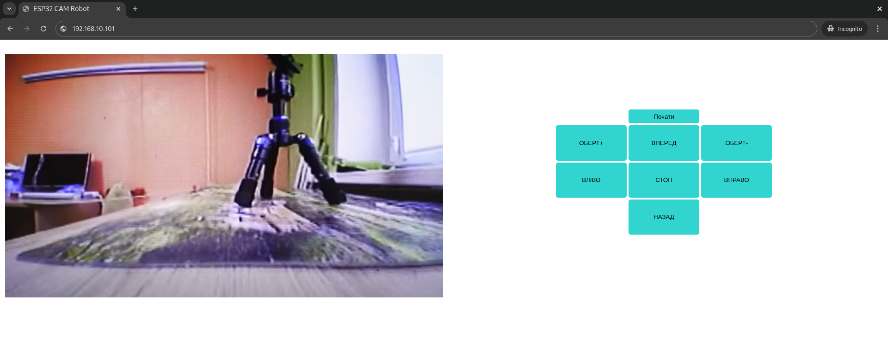
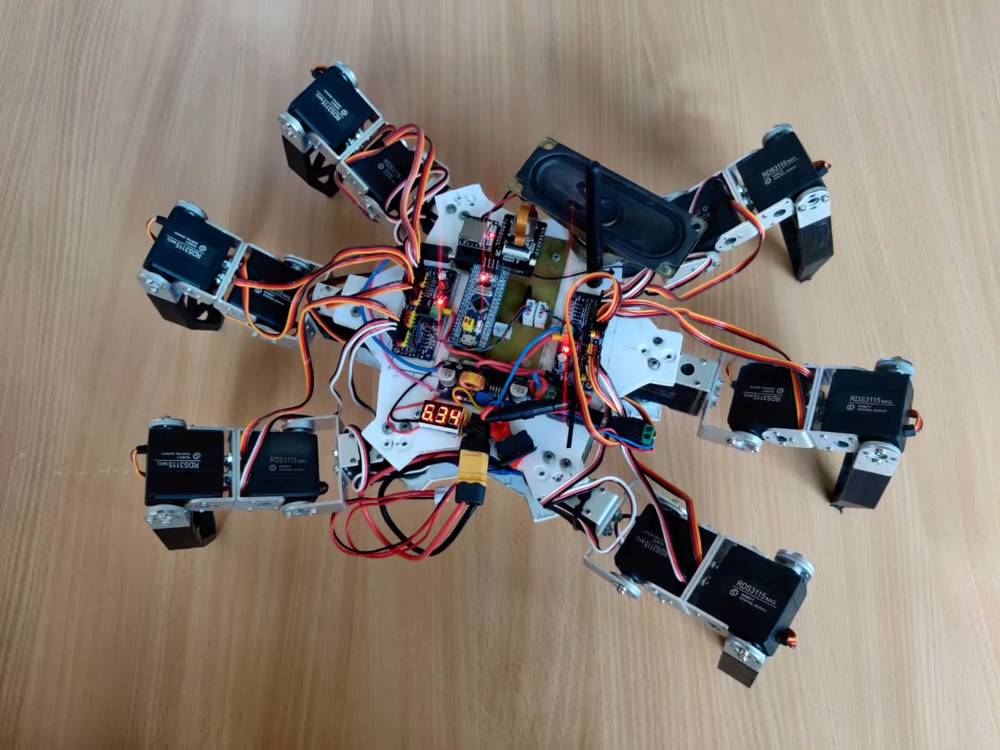

# RUSARPION 🕷️  
**Hexapod robot with vector-based motion control, STM32 servo coordination, and web UI via ESP32-CAM.**

## 🎬 Demo

  
*Web interface to send motion vectors and view video*

  
*The RUSARPION hexapod robot*

  
*Walking cycle using inverse kinematics and vector input*

---

## 🧠 Project Summary

**RUSARPION** is a six-legged spider robot powered by **STM32 + ESP32**.  
Each leg has 3 servo motors (18 total), coordinated via:

- 🧮 **Inverse kinematics** (IK) for leg movement
- 🕹️ **Vector-based control**: specify movement direction & speed
- 🧱 **Modular OOP design**: servo → leg → robot → control
- 🚷 **Motion constraints** to prevent mechanical collisions or servo burnout

ESP32-CAM provides a **web UI** for user interaction and video streaming.  
It sends commands over **UART** to STM32, which handles servo control via a **PCA9685** 16-channel PWM driver.

> 🔗 [ESP32 robot with video streaming](https://github.com/yourname/esp32-video-robot) — previous project this builds upon.

---

## ⚙️ Tech Stack

- **Microcontrollers**:  
  - STM32: kinematics + servo control  
  - ESP32-CAM: web UI + video stream + UART command bridge
- **Servo Driver**: PCA9685 (16-channel I2C PWM)
- **Control Flow**:  
  - JS frontend → ESP32 (web server) → UART → STM32 → PWM

---

## 🇺🇦 Опис українською

**RUSARPION** — це шестилапий робот-павук з векторним керуванням.  
Кожна лапа має 3 сервоприводи, всього 18. Система побудована на:

- 🧠 **Оберненій кінематиці** для руху лап
- 🕹️ **Векторному керуванні**: задається напрямок та швидкість
- ⚙️ **ООП-структурі**: серво → лапа → павук з налаштовуваними обмеженнями
- 🧠 **STM32** розраховує і генерує ШІМ сигнали через **PCA9685**
- 🌐 **ESP32-CAM** забезпечує відео + керування через браузер

> 🔗 Цей проєкт розширює [попереднього робота з ESP32](https://github.com/Tataty/esp32-video-robot), де досліджувався відеострімінг та веб-керування.

---

## 💡 What I learned

- Реалізація кінематичних розрахунків для багатоногих систем
- Абстрагування структури через класи: `Servo`, `Leg`, `Spider`
- Керування 18 сервоприводами через I2C-драйвер PCA9685
- Розділення логіки між STM32 (реакція) та ESP32 (інтерфейс)

---

## 🚀 How to run

1. Flash STM32 with inverse kinematics + servo logic
2. Flash ESP32-CAM with web interface + UART command bridge
3. Power both controllers + servo power rail
4. Connect to ESP32 IP address
5. Use browser to send vectors and watch live stream

---

## 👤 Author

Created by [Ruslan](https://github.com/Tataty)
